# Nom des pièeces - Impression 3D.pdf

<!--
pdf.src.url: 
pdf.src.datetime: 
pdf.file: /home/q6/github/li3d.fr-forum-glossaire-definitions/autre_glossaire/pdf_GL/pdf.orig/Nom des pièeces - Impression 3D.pdf
pdf.file.length: 955679
pdf.file.md5sum: 
pdf.DocumentId: null
pdf.NumberOfPages: 13
pdf.Version: 1.7
-->
<!--
pdfTextStripper.SortByPosition: false
pdfTextStripper.ShouldSeparateByBeads: true
pdfTextStripper.AddMoreFormatting: true
-->
## page 1

<!--
img.getSuffix: png
img.getHeight: 572
img.getWidth: 572
img.getInterpolate: false
img.getCOSObject.getLength: 32386
-->
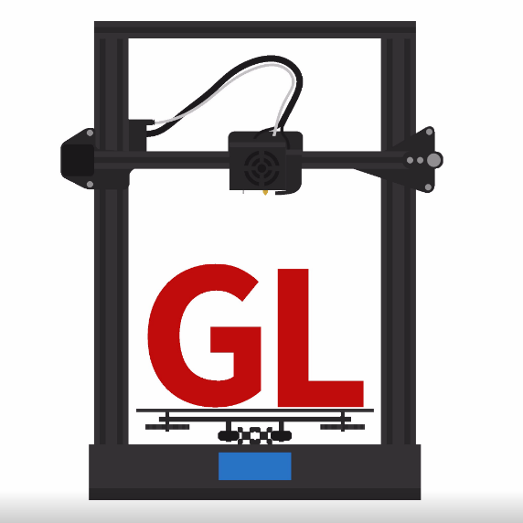
<!--
img.save.file: ./out/pdf_GL/img/-ImgNum-0-PageNum-0.png
img.save.file.length: 35050
-->

 

 

 

    Noms des pièces 

    Impression 3D 

www.youtube.com/Legueroloco 
 
---
 

Image 

Noms français 

Noms anglais 

Description sommaire 

---

<!--
img.getSuffix: jpg
img.getHeight: 321
img.getWidth: 341
img.getInterpolate: true
img.getCOSObject.getLength: 8637
-->
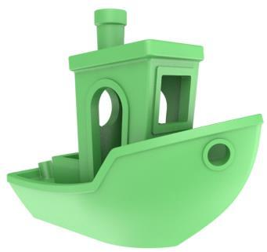
<!--
img.save.file: ./out/pdf_GL/img/-ImgNum-1-PageNum-0.jpg
img.save.file.length: 8645
-->
 

* Impression 3D
* Fabrication additive par dépôt de filament
* Dépôt de file en fusion

* 3D Print
* Fuse deposit modeling (FDM)

Impression 3D à filament – Le plus commun 

---

## page 2

<!--
img.getSuffix: jpg
img.getHeight: 322
img.getWidth: 339
img.getInterpolate: true
img.getCOSObject.getLength: 9815
-->
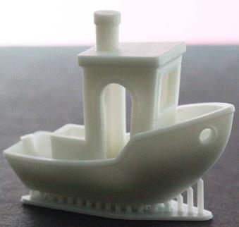
<!--
img.save.file: ./out/pdf_GL/img/-ImgNum-2-PageNum-1.jpg
img.save.file.length: 9796
-->

 

* Stéréolithographie (SLA) 
* Impression 3D à la résine 
* Impression 3D aux UV 
* Impression DLP 
* Impression 3D au laser 
* Impression 3D à la résine

* Stereolithography (SLA) 
* Resin printing 
* UV 3D printing 
* Digital light processing (DLP) 
* Laser 3D printing 
* Resin 3D printing

Impression à la résine, le plus 
commun, basé sur un écran LCD 
servant de gabarit et une lumière 
UV le traversant. 
D’autre, utilisent un laser redirigé 
par un miroir faisant durcir la 
résine. 

---

<!--
img.getSuffix: jpg
img.getHeight: 464
img.getWidth: 384
img.getInterpolate: true
img.getCOSObject.getLength: 31573
-->
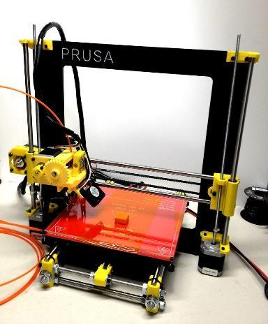
<!--
img.save.file: ./out/pdf_GL/img/-ImgNum-3-PageNum-1.jpg
img.save.file.length: 31519
--> 

* Imprimante 3D cartésienne

* Cartesian 3D  printer

Imprimante 3D à filament le plus 
populaire. 
La plateforme d’impression se 
déplace avant/arrière pour le 
mouvement du Y, et l’axe des X 
se monte et descend pour le 
mouvement du Z. 

---

<!--
img.getSuffix: jpg
img.getHeight: 514
img.getWidth: 318
img.getInterpolate: true
img.getCOSObject.getLength: 25762
-->
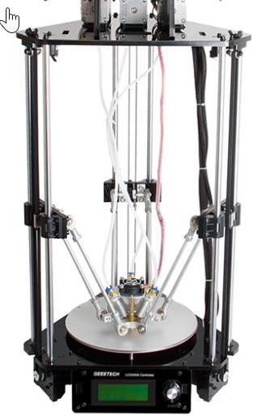
<!--
img.save.file: ./out/pdf_GL/img/-ImgNum-4-PageNum-1.jpg
img.save.file.length: 25615
--> 

* Imprimante 3D Delta

* Delta 3D printer

Imprimante 3D à filament réputé 
pour sa vitesse, mais aussi sa 
complexité de calibrage. 
La X/Y et Z sont couver par un 
mouvement simultané des 3 
axes. 

---

<!--
img.getSuffix: jpg
img.getHeight: 315
img.getWidth: 344
img.getInterpolate: true
img.getCOSObject.getLength: 22620
-->
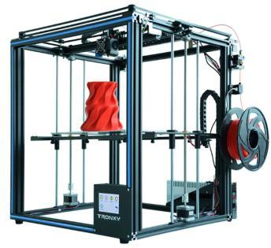
<!--
img.save.file: ./out/pdf_GL/img/-ImgNum-5-PageNum-1.jpg
img.save.file.length: 22642
-->

 

* Imprimante Core XY

* Core XY

Imprimante plus stable que les 
cartésienne, avec une système de 
courroie souvent plus complexe. 
Le X/Y sont à la tête de 
l’imprimante, et la plateforme se 
déplace de haut en bas pour le 
mouvement du Z. 

---

## page 3

---

<!--
img.getSuffix: jpg
img.getHeight: 259
img.getWidth: 194
img.getInterpolate: true
img.getCOSObject.getLength: 5862
-->
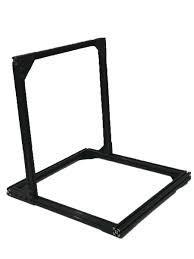
<!--
img.save.file: ./out/pdf_GL/img/-ImgNum-6-PageNum-2.jpg
img.save.file.length: 5777
-->

 

* Châssis

* Frame

Châssis de l’imprimante, 
normalement fais d’extrusion 
d’aluminium 2020, 4020 ou 4040. 

---

<!--
img.getSuffix: jpg
img.getHeight: 384
img.getWidth: 384
img.getInterpolate: true
img.getCOSObject.getLength: 10215
-->
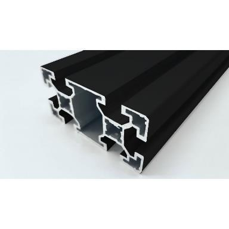
<!--
img.save.file: ./out/pdf_GL/img/-ImgNum-7-PageNum-2.jpg
img.save.file.length: 10238
--> 

* Extrusion d’aluminium 
* Profile d’aluminum

* Aliminum profil 
* Aluminium extrusion

On les identifie normalement par 
leur dimension en mm 
Ex : 4020 représente 40mm X 
20mm 

---

<!--
img.getSuffix: jpg
img.getHeight: 383
img.getWidth: 272
img.getInterpolate: true
img.getCOSObject.getLength: 14383
-->
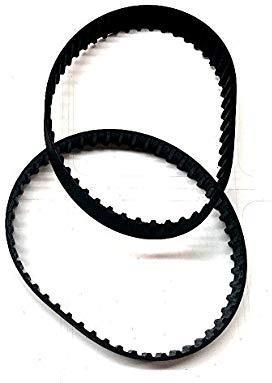
<!--
img.save.file: ./out/pdf_GL/img/-ImgNum-8-PageNum-2.jpg
img.save.file.length: 14371
-->
 

Courroies 
Bandes 

Belt 

Normalement, les model GT2-
6mm sont utilisés dans la plupart 
des imprimantes du marché.  Il y 
à aussi du GT2-10 et d’autre 
types disponibles 

---

<!--
img.getSuffix: jpg
img.getHeight: 233
img.getWidth: 347
img.getInterpolate: true
img.getCOSObject.getLength: 10605
-->
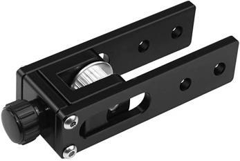
<!--
img.save.file: ./out/pdf_GL/img/-ImgNum-9-PageNum-2.jpg
img.save.file.length: 10592
-->
 

Tensioneur 
 

Tensioner 
 

Permettant d’ajuster la tension 
des courroies 

---

<!--
img.getSuffix: jpg
img.getHeight: 220
img.getWidth: 376
img.getInterpolate: true
img.getCOSObject.getLength: 13153
-->
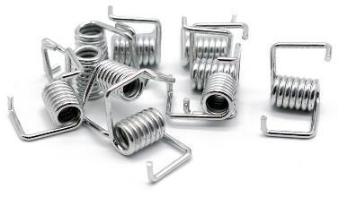
<!--
img.save.file: ./out/pdf_GL/img/-ImgNum-10-PageNum-2.jpg
img.save.file.length: 13143
-->

 

Ressort de courroie 

Tensioning spring 

Permettant d’augmenter la 
tension sur les courroies 

---

## page 4

<!--
img.getSuffix: jpg
img.getHeight: 188
img.getWidth: 250
img.getInterpolate: true
img.getCOSObject.getLength: 6315
-->
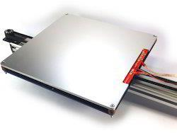
<!--
img.save.file: ./out/pdf_GL/img/-ImgNum-11-PageNum-3.jpg
img.save.file.length: 6308
-->

<!--
img.getSuffix: jpg
img.getHeight: 154
img.getWidth: 348
img.getInterpolate: true
img.getCOSObject.getLength: 7958
-->
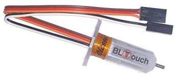
<!--
img.save.file: ./out/pdf_GL/img/-ImgNum-12-PageNum-3.jpg
img.save.file.length: 7960
-->

<!--
img.getSuffix: jpg
img.getHeight: 377
img.getWidth: 209
img.getInterpolate: true
img.getCOSObject.getLength: 12426
-->
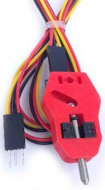
<!--
img.save.file: ./out/pdf_GL/img/-ImgNum-13-PageNum-3.jpg
img.save.file.length: 12415
-->

<!--
img.getSuffix: jpg
img.getHeight: 415
img.getWidth: 452
img.getInterpolate: true
img.getCOSObject.getLength: 45031
-->
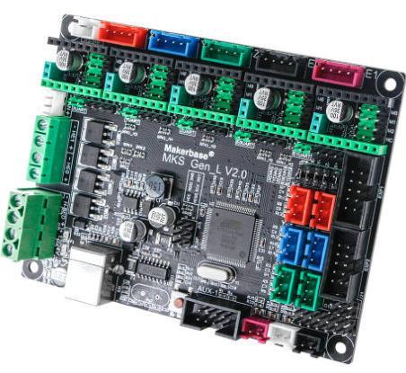
<!--
img.save.file: ./out/pdf_GL/img/-ImgNum-14-PageNum-3.jpg
img.save.file.length: 44957
-->

<!--
img.getSuffix: jpg
img.getHeight: 319
img.getWidth: 319
img.getInterpolate: true
img.getCOSObject.getLength: 8816
-->
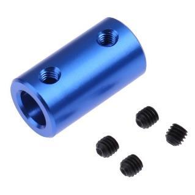
<!--
img.save.file: ./out/pdf_GL/img/-ImgNum-15-PageNum-3.jpg
img.save.file.length: 8813
-->

 

Lit 
Lit chauffant 
Plateforme 
Surface d’impression 

Bed 
Heating bed 

Plateforme recevant l’impression, 
chauffant ou non 

 Autonivellement Auto Leveling System de nivellement 
automatique du lit 

 

BLtouch (Antclab) 
3Dtouch(Geeetech) 

BLtouch (Antclab) 
3Dtouch(Geeetech) 

Capteur de nivellement 
automatique du lit par palpation 
et rétraction automatique 

 

TouchMI (Hotends.fr) TouchMI (Hotends.fr) Capteur de nivellement 
automatique du lit par palpation 
avec système de rétention 
magnétique 

 

Carte mère 
Carte contrôleur  

Board 
Motherboard 
Controlboard 
Controller board 

Carte mère contrôlant les 
différentes composantes 
électroniques de l’imprimante 

 

Coupleurs Couplers Pièce flexibe, semi flexible ou 
rigide tenant normalement une 
tige ou vis à un pôle de moteur 

## page 5

<!--
img.getSuffix: jpg
img.getHeight: 283
img.getWidth: 267
img.getInterpolate: true
img.getCOSObject.getLength: 6909
-->
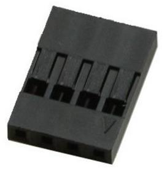
<!--
img.save.file: ./out/pdf_GL/img/-ImgNum-16-PageNum-4.jpg
img.save.file.length: 6913
-->

<!--
img.getSuffix: jpg
img.getHeight: 262
img.getWidth: 262
img.getInterpolate: true
img.getCOSObject.getLength: 6348
-->
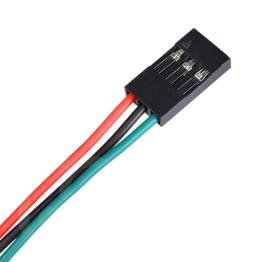
<!--
img.save.file: ./out/pdf_GL/img/-ImgNum-17-PageNum-4.jpg
img.save.file.length: 6328
-->

<!--
img.getSuffix: jpg
img.getHeight: 200
img.getWidth: 405
img.getInterpolate: true
img.getCOSObject.getLength: 12406
-->
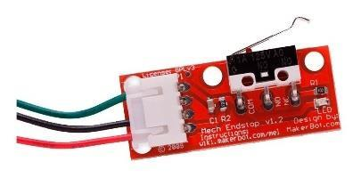
<!--
img.save.file: ./out/pdf_GL/img/-ImgNum-18-PageNum-4.jpg
img.save.file.length: 12400
-->

<!--
img.getSuffix: jpg
img.getHeight: 399
img.getWidth: 379
img.getInterpolate: true
img.getCOSObject.getLength: 21273
-->
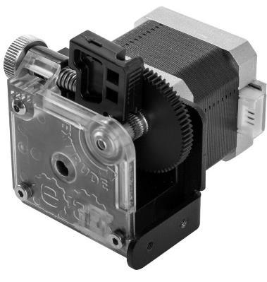
<!--
img.save.file: ./out/pdf_GL/img/-ImgNum-19-PageNum-4.jpg
img.save.file.length: 21281
-->

<!--
img.getSuffix: jpg
img.getHeight: 323
img.getWidth: 407
img.getInterpolate: true
img.getCOSObject.getLength: 13556
-->
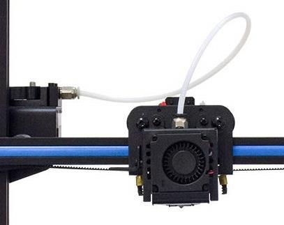
<!--
img.save.file: ./out/pdf_GL/img/-ImgNum-20-PageNum-4.jpg
img.save.file.length: 13544
-->

 

Connecteur Dupont Dupont connector Connecteur standard avec un pas 
de 2.54mm (commun) ou de 
2mm 

 

Câble Dupont Dupont Cable Cable avec connecteur Dupont 

 

Détecteur de fin de course Endstop 
Endstop detector 
 

Détecteur mécanique, 
magnétique ou optique de fin de 
course d’un axe 

 

Extrudeur Extruder Système d’entrainement du 
filament vers la tête de chauffe 

 

Bowden 
Extrudeur Bowden 
Extrudeur déporté 

Bowden Extruder 
 

Système d’extrusion avec 
système d’entrainement déporté 
et relié par un tube de PTFE 

## page 6

<!--
img.getSuffix: jpg
img.getHeight: 322
img.getWidth: 195
img.getInterpolate: true
img.getCOSObject.getLength: 11242
-->
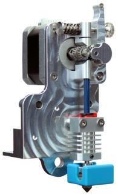
<!--
img.save.file: ./out/pdf_GL/img/-ImgNum-21-PageNum-5.jpg
img.save.file.length: 11211
-->

<!--
img.getSuffix: jpg
img.getHeight: 345
img.getWidth: 345
img.getInterpolate: true
img.getCOSObject.getLength: 4661
-->
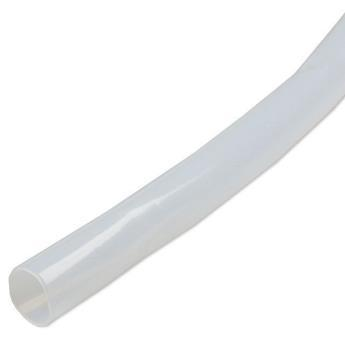
<!--
img.save.file: ./out/pdf_GL/img/-ImgNum-22-PageNum-5.jpg
img.save.file.length: 4658
-->

<!--
img.getSuffix: jpg
img.getHeight: 378
img.getWidth: 378
img.getInterpolate: true
img.getCOSObject.getLength: 15644
-->
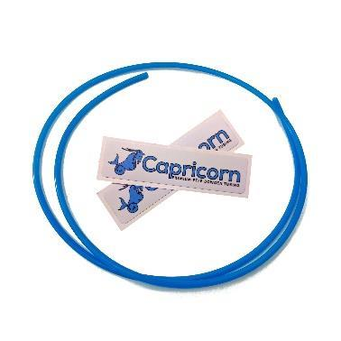
<!--
img.save.file: ./out/pdf_GL/img/-ImgNum-23-PageNum-5.jpg
img.save.file.length: 15650
-->

<!--
img.getSuffix: jpg
img.getHeight: 183
img.getWidth: 248
img.getInterpolate: true
img.getCOSObject.getLength: 5256
-->
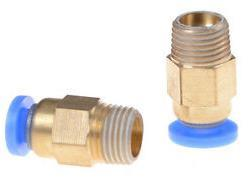
<!--
img.save.file: ./out/pdf_GL/img/-ImgNum-24-PageNum-5.jpg
img.save.file.length: 5256
-->

 

Direct Drive 
Extrusion directe 

Direct Drive Système d’extrusion avec 
système d’entrainement attaché  
très près de la tête de chauffe 

 

PTFE 
Tuyau / tube de PTFE 
Tuyau / tube de téflon 
 

PTFE  
PTFE tube 

Tube non adhésif pour passer le 
filament avec une friction 
minimum 

 

Capricon 
Tube Capricorn 
PTFE Capricorne 
 

Capricorn 
Capriciorn tubing 
Capricorn PTFE 

Tube de PTFE de marque 
Capricorn – À la réputation d’être 
haut de gamme 

 

Connecteur PTFE 
Connecteur pneufit 
Connecteur pneumatique 

PTFE connector 
Pneufit connector 
Pneumatic fiting 
Push-in fitting 

Connecteur pour tube de PTFE.  
Deux grandeurs communes :  
PC4-M10 et PC4-M6.  D’autres 
modèles existent aussi. 

## page 7

<!--
img.getSuffix: jpg
img.getHeight: 371
img.getWidth: 371
img.getInterpolate: true
img.getCOSObject.getLength: 15988
-->
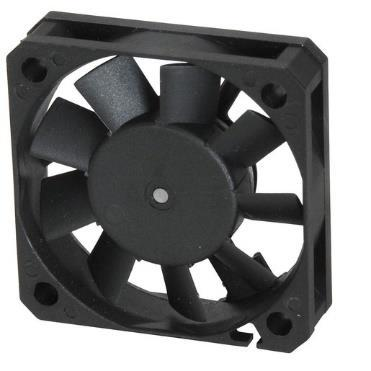
<!--
img.save.file: ./out/pdf_GL/img/-ImgNum-25-PageNum-6.jpg
img.save.file.length: 15965
-->

<!--
img.getSuffix: jpg
img.getHeight: 304
img.getWidth: 396
img.getInterpolate: true
img.getCOSObject.getLength: 11430
-->
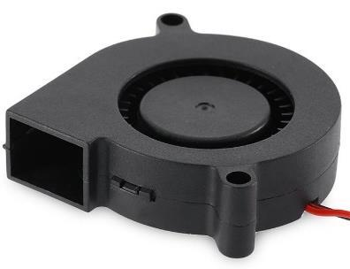
<!--
img.save.file: ./out/pdf_GL/img/-ImgNum-26-PageNum-6.jpg
img.save.file.length: 11418
-->

<!--
img.getSuffix: jpg
img.getHeight: 344
img.getWidth: 344
img.getInterpolate: true
img.getCOSObject.getLength: 6929
-->
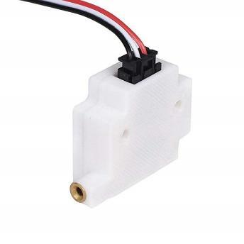
<!--
img.save.file: ./out/pdf_GL/img/-ImgNum-27-PageNum-6.jpg
img.save.file.length: 6921
-->

<!--
img.getSuffix: jpg
img.getHeight: 352
img.getWidth: 352
img.getInterpolate: true
img.getCOSObject.getLength: 10523
-->
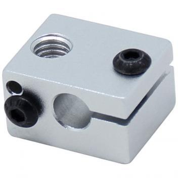
<!--
img.save.file: ./out/pdf_GL/img/-ImgNum-28-PageNum-6.jpg
img.save.file.length: 10525
-->

 

Ventilateur Fan Pour refroidissement.  Ils sont 
nommés par leur dimension 
Ex :5015 – 50mm X 15mm 

 

Ventilateur radial Radial fan Ventilateur radial.  Souvent moins 
bruyant et plus performant que 
les ventilateurs de types ouverts 

 

Détecteur de filament Filament sensor Détecteur mécanique, 
magnétique ou optique de 
présence de filament – permet de 
mettre saur pause l’imprimante 
en cas de manque de filament 

 

Bloc de chauffe Heat bloc 
Heated bloc 

Bloc normalement d’aluminium, 
de cuivre ou laiton recevant la 
buse, la cartouche chauffante et 
le détecteur de filament.  Il 
permet la dissipation de la 
chaleur de la cartouche 
chauffante jusqu’à la buse 

## page 8

<!--
img.getSuffix: jpg
img.getHeight: 389
img.getWidth: 347
img.getInterpolate: true
img.getCOSObject.getLength: 10684
-->
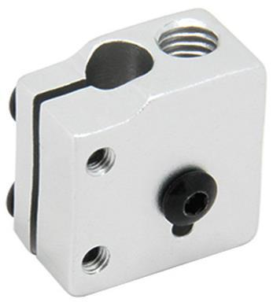
<!--
img.save.file: ./out/pdf_GL/img/-ImgNum-29-PageNum-7.jpg
img.save.file.length: 10571
-->

<!--
img.getSuffix: jpg
img.getHeight: 416
img.getWidth: 416
img.getInterpolate: true
img.getCOSObject.getLength: 15334
-->
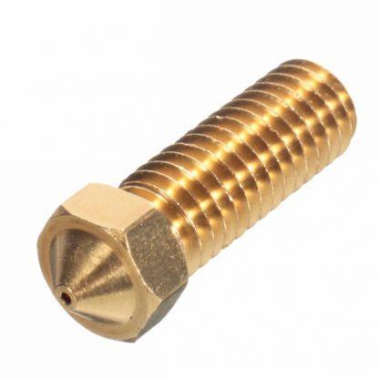
<!--
img.save.file: ./out/pdf_GL/img/-ImgNum-30-PageNum-7.jpg
img.save.file.length: 15151
-->

<!--
img.getSuffix: jpg
img.getHeight: 347
img.getWidth: 347
img.getInterpolate: true
img.getCOSObject.getLength: 15058
-->
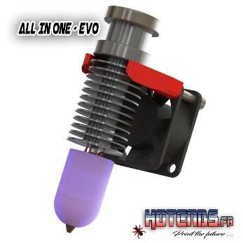
<!--
img.save.file: ./out/pdf_GL/img/-ImgNum-31-PageNum-7.jpg
img.save.file.length: 15033
-->

<!--
img.getSuffix: jpg
img.getHeight: 86
img.getWidth: 342
img.getInterpolate: true
img.getCOSObject.getLength: 5132
-->
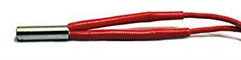
<!--
img.save.file: ./out/pdf_GL/img/-ImgNum-32-PageNum-7.jpg
img.save.file.length: 5130
-->

<!--
img.getSuffix: jpg
img.getHeight: 458
img.getWidth: 458
img.getInterpolate: true
img.getCOSObject.getLength: 14085
-->
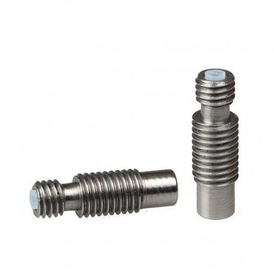
<!--
img.save.file: ./out/pdf_GL/img/-ImgNum-33-PageNum-7.jpg
img.save.file.length: 13991
-->

 

Bloc Volcano Volcano nozzle 
Volcano heatbloc 

Bloc de chauffe positionner sur la 
longeur, et buse plus longe, pour 
un plus grand débit de filament 

 

Buse volacano Volcano nozzle Buse plus longue fait pour les 
blocs de chauffe volcano 

 

Buse AIO EVO 
Tète de chauffe AIO EVO 
(Hotends.fr) 

Heatblock AIO EVO (All-In-One) 
(Hotends-fr) 

Tête de chauffe conçu par 
Hotends.fr 

 

Cartouche chauffante 
Cartouche de chauffe 
Élément 
Résistance chauffante 

Heating cartridge 
Heating resistor 

Cartouche normalement de 40w 
(50 et 60w aussi disponible) 
chauffant le bloc de chauffe 

 

Pont 
Pont thermique 
Col 
 

Heatbreak 
Hreat break  

Pont thermique diminuant le 
transfert de chaleur entre le 
dissipateur de chaleur et le bloc 
de chauffe.  Plusieurs modèles 
existent 

## page 9

<!--
img.getSuffix: jpg
img.getHeight: 272
img.getWidth: 317
img.getInterpolate: true
img.getCOSObject.getLength: 16696
-->
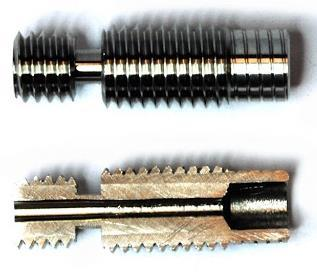
<!--
img.save.file: ./out/pdf_GL/img/-ImgNum-34-PageNum-8.jpg
img.save.file.length: 16688
-->

<!--
img.getSuffix: jpg
img.getHeight: 294
img.getWidth: 294
img.getInterpolate: true
img.getCOSObject.getLength: 8628
-->
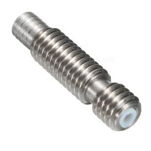
<!--
img.save.file: ./out/pdf_GL/img/-ImgNum-35-PageNum-8.jpg
img.save.file.length: 8539
-->

<!--
img.getSuffix: jpg
img.getHeight: 255
img.getWidth: 240
img.getInterpolate: true
img.getCOSObject.getLength: 10823
-->
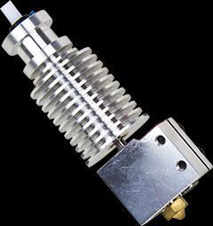
<!--
img.save.file: ./out/pdf_GL/img/-ImgNum-36-PageNum-8.jpg
img.save.file.length: 10699
-->

<!--
img.getSuffix: jpg
img.getHeight: 351
img.getWidth: 351
img.getInterpolate: true
img.getCOSObject.getLength: 13309
-->
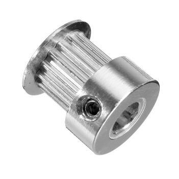
<!--
img.save.file: ./out/pdf_GL/img/-ImgNum-37-PageNum-8.jpg
img.save.file.length: 13310
-->

<!--
img.getSuffix: jpg
img.getHeight: 422
img.getWidth: 374
img.getInterpolate: true
img.getCOSObject.getLength: 10162
-->
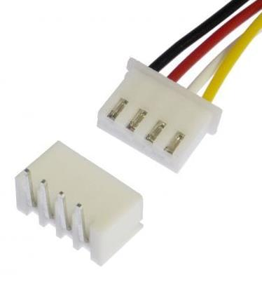
<!--
img.save.file: ./out/pdf_GL/img/-ImgNum-38-PageNum-8.jpg
img.save.file.length: 10161
-->

 

Pont Plein métal 
 

Full metal heatbreak Pont thermique 100% en métal 

 

Pont avec PTFE Heatbreak with PTFE Pont thermique ayant un tube de 
PTFE – Aide à la rétraction et 
empêche le filament de coller à 
l’intérieur – ne pas dépasser les 
250c. 

 

Tête de chauffe Hotend Ensemble comportant la buse, 
bloc de chauffe, dissipateur et 
buse 

 

Roue dentelée 
Poulie (de l’anglais Pulley, 
mauvaise utilisation) 

Pulley 
gear 

Roue dentelée normalement 
utilisé pour recevoir une 
courroies – Plusieurs modèle 
existent 

 

Connecteur JST JST connecteur Connecteur plus dense que les 
Dupont, souvent en montage de 
surface. 

## page 10

<!--
img.getSuffix: jpg
img.getHeight: 284
img.getWidth: 383
img.getInterpolate: true
img.getCOSObject.getLength: 19493
-->
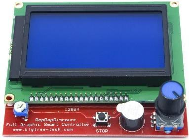
<!--
img.save.file: ./out/pdf_GL/img/-ImgNum-39-PageNum-9.jpg
img.save.file.length: 19477
-->

<!--
img.getSuffix: jpg
img.getHeight: 267
img.getWidth: 340
img.getInterpolate: true
img.getCOSObject.getLength: 18846
-->
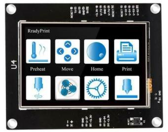
<!--
img.save.file: ./out/pdf_GL/img/-ImgNum-40-PageNum-9.jpg
img.save.file.length: 18796
-->

<!--
img.getSuffix: jpg
img.getHeight: 186
img.getWidth: 341
img.getInterpolate: true
img.getCOSObject.getLength: 5989
-->
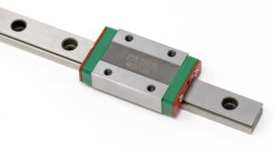
<!--
img.save.file: ./out/pdf_GL/img/-ImgNum-41-PageNum-9.jpg
img.save.file.length: 5988
-->

<!--
img.getSuffix: jpg
img.getHeight: 214
img.getWidth: 240
img.getInterpolate: true
img.getCOSObject.getLength: 6133
-->
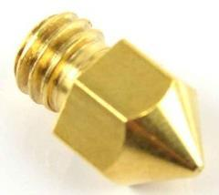
<!--
img.save.file: ./out/pdf_GL/img/-ImgNum-42-PageNum-9.jpg
img.save.file.length: 6009
-->

<!--
img.getSuffix: jpg
img.getHeight: 374
img.getWidth: 374
img.getInterpolate: true
img.getCOSObject.getLength: 20894
-->
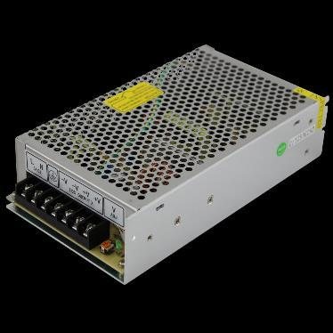
<!--
img.save.file: ./out/pdf_GL/img/-ImgNum-43-PageNum-9.jpg
img.save.file.length: 20780
-->

 
 
 

Contrôleur LCD 
Panneau LCD 
Écran 
Écran avec encodeur (de l’anglais) 

LCD screen 
LCD Controller 
Controlleur with encoder 
Smart display 
Smart controller 
Display 

Écran LCD permettant des 
opérations sur l’imprimante,  

 

Écran tactile 
LCD tactile 
MKS-TFT 
 
 

Touch screen 
Touch controller 
Touch LCD 
MKS-TFT 

Contrôleur LCD avec contrôle 
tactile.  Les modèles les plus 
connus sont les MKS TFT 

 

Roulement à billes linéaire 
Roulement linéaire 
Guide linéaire 

Linear Bearing 
Linear rails 
Linera guide 

Système de roulement à bille sur 
rail 

 

Buse Nozzle Pièce normalement de métal 
définissant la grosseur 
d’extrusion, normalement en 0.4, 
mais aussi disponible entre 0.1 à 
1.5mm de sortie 

 

Alimentation 
Boitier d’alimentation 
 

PSU (Power Supply Unit) 
Power supply 

Alimentation, normalement 12 
ou 24 volts de sortie. 

## page 11

<!--
img.getSuffix: jpg
img.getHeight: 364
img.getWidth: 364
img.getInterpolate: true
img.getCOSObject.getLength: 14290
-->
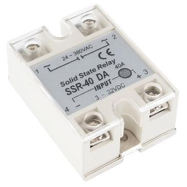
<!--
img.save.file: ./out/pdf_GL/img/-ImgNum-44-PageNum-10.jpg
img.save.file.length: 14290
-->

<!--
img.getSuffix: jpg
img.getHeight: 288
img.getWidth: 352
img.getInterpolate: true
img.getCOSObject.getLength: 20408
-->
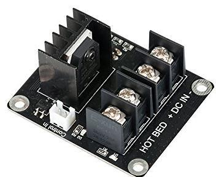
<!--
img.save.file: ./out/pdf_GL/img/-ImgNum-45-PageNum-10.jpg
img.save.file.length: 20260
-->

<!--
img.getSuffix: jpg
img.getHeight: 296
img.getWidth: 326
img.getInterpolate: true
img.getCOSObject.getLength: 11598
-->
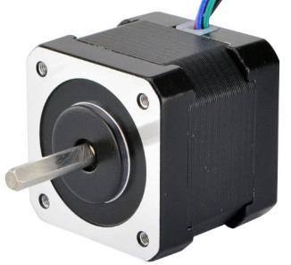
<!--
img.save.file: ./out/pdf_GL/img/-ImgNum-46-PageNum-10.jpg
img.save.file.length: 11587
-->

<!--
img.getSuffix: jpg
img.getHeight: 335
img.getWidth: 350
img.getInterpolate: true
img.getCOSObject.getLength: 16492
-->
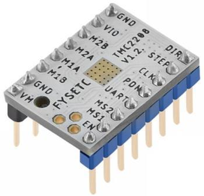
<!--
img.save.file: ./out/pdf_GL/img/-ImgNum-47-PageNum-10.jpg
img.save.file.length: 16492
-->

<!--
img.getSuffix: jpg
img.getHeight: 303
img.getWidth: 303
img.getInterpolate: true
img.getCOSObject.getLength: 10232
-->
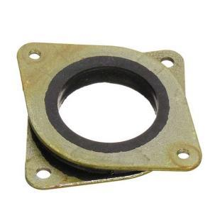
<!--
img.save.file: ./out/pdf_GL/img/-ImgNum-48-PageNum-10.jpg
img.save.file.length: 10240
-->

 

Relai SSR Solid State Relay Relai non mécanique 

 

Mosfet 
Relai 

Mosfet (metal–oxide–
semiconductor field-effect 
transistor) 
Relay 

Relai non mécanique 

 

Moteur pas à pas 
Moteur 
Stepper 

Stepper motor 
Stepper 
Motor 

Moteur à mouvement pas à pas 
normalement de 1.8 degré, mais 
aussi disponible dans le 0.9 
degré. Les plus commun en 
impression 3D sont les nema17 

 

Pilote 
Driver (de l’anglais) 
Contrôleur de moteur pas a pas 

Driver 
Stepper driver 
Stepper motor driver 

Contrôleur pour moteur pas a 
pas, aussi appeler par leur 
modèles : ex : A4988, DRV8825, 
TMC2208, TMC2100, etc. 

 

Absorbeur de vibration 
Absorbeur de choque 
Damper 

Damper 
Choc absorber 
Silent bloc 

Pièce normalement composée de 
deux couches de métal joint par 
une épaisseur de caoutchouc 
diminuant la transmission des 
vibrations causées par le moteurs 
pas à pas 

## page 12

<!--
img.getSuffix: jpg
img.getHeight: 230
img.getWidth: 230
img.getInterpolate: true
img.getCOSObject.getLength: 7507
-->
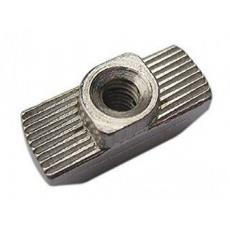
<!--
img.save.file: ./out/pdf_GL/img/-ImgNum-49-PageNum-11.jpg
img.save.file.length: 7516
-->

<!--
img.getSuffix: jpg
img.getHeight: 197
img.getWidth: 327
img.getInterpolate: true
img.getCOSObject.getLength: 11920
-->

<!--
img.save.file: ./out/pdf_GL/img/-ImgNum-50-PageNum-11.jpg
img.save.file.length: 11927
-->

<!--
img.getSuffix: jpg
img.getHeight: 230
img.getWidth: 341
img.getInterpolate: true
img.getCOSObject.getLength: 5826
-->

<!--
img.save.file: ./out/pdf_GL/img/-ImgNum-51-PageNum-11.jpg
img.save.file.length: 5815
-->

<!--
img.getSuffix: jpg
img.getHeight: 229
img.getWidth: 335
img.getInterpolate: true
img.getCOSObject.getLength: 7612
-->

<!--
img.save.file: ./out/pdf_GL/img/-ImgNum-52-PageNum-11.jpg
img.save.file.length: 7610
-->

<!--
img.getSuffix: jpg
img.getHeight: 259
img.getWidth: 234
img.getInterpolate: true
img.getCOSObject.getLength: 8570
-->

<!--
img.save.file: ./out/pdf_GL/img/-ImgNum-53-PageNum-11.jpg
img.save.file.length: 8561
-->

<!--
img.getSuffix: jpg
img.getHeight: 366
img.getWidth: 367
img.getInterpolate: true
img.getCOSObject.getLength: 12486
-->

<!--
img.save.file: ./out/pdf_GL/img/-ImgNum-54-PageNum-11.jpg
img.save.file.length: 12489
-->

 

Écrou marteau T-Nut 
Hammer nut 

Écrous s’insérant dans les 
extrusions d’aluminium 

 

TLSmoother 
Pont diode (moins commun) 

TLSmoother Pont diode réduisant certaine 
imperfection causée par certain 
pilotes de moteurs pas à pas 
(A4988 et DRV8825) 

 

Capteur de température 
Thermistance 

Heat sensor 
Thermistor 
Heat sensor 

Sonde de température. Le plus 
communs sont le NTC 100, mais il 
y aussi de PT-100 de plus en plus 
populaire 

 

Support de filament 
Support de bobine 

Spool holder Support de bobine de filament 

 

Roue 
Roue en V 
Roue pour extrusion 
Roue pour extrusion en v 
 

V-Slot Wheel Roue permettant de se déplacer 
sur les extrusions d’aluminium 

 

Vis trapézoïdale 
Tige trapézoïdale  
Vise sans fin 

Lead Screw Vis sans fin, normalement sur 
l’axe Z des imprimantes 
cartésienne. Les vis 
communément utilisées on des 
pas de 8mm 

## page 13

<!--
img.getSuffix: jpg
img.getHeight: 235
img.getWidth: 230
img.getInterpolate: true
img.getCOSObject.getLength: 8025
-->

<!--
img.save.file: ./out/pdf_GL/img/-ImgNum-55-PageNum-12.jpg
img.save.file.length: 7909
-->

<!--
img.getSuffix: png
img.getHeight: 130
img.getWidth: 387
img.getInterpolate: false
img.getCOSObject.getLength: 4308
-->

<!--
img.save.file: ./out/pdf_GL/img/-ImgNum-56-PageNum-12.png
img.save.file.length: 4800
-->

<!--
img.getSuffix: jpg
img.getHeight: 329
img.getWidth: 332
img.getInterpolate: true
img.getCOSObject.getLength: 8479
-->

<!--
img.save.file: ./out/pdf_GL/img/-ImgNum-57-PageNum-12.jpg
img.save.file.length: 8483
-->

<!--
img.getSuffix: jpg
img.getHeight: 361
img.getWidth: 361
img.getInterpolate: true
img.getCOSObject.getLength: 13236
-->

<!--
img.save.file: ./out/pdf_GL/img/-ImgNum-58-PageNum-12.jpg
img.save.file.length: 9863
-->

 

Écrou de vise trapézoïdale Lead Screw Nut Écrou allant sur la vise 
trapézoïdale 

 

Microcode Firmware Code de programmation de la 
carte même.  Le plus utiliser est 
Marlin, mais il en existe d’autre, 
tel que Klipper, Prusa, Smoothie, 
Repetier 

 

Chausette de silicone Silicone sock Protecteur allant sur le bloc de 
chauffe pour garder la 
température stable. 

 

Écrou excentrique Eccentric nut Permet d’ajuster la tension des 
roue sur les extrusion 
d’aluminium 

 

